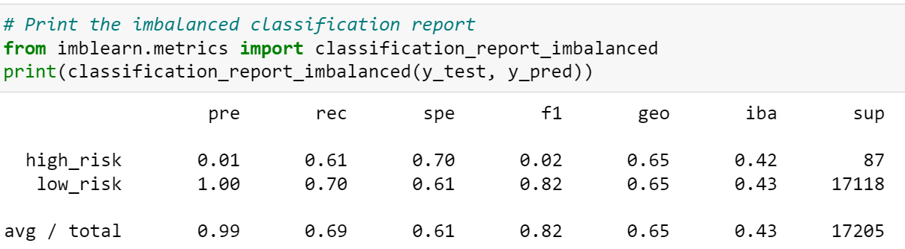
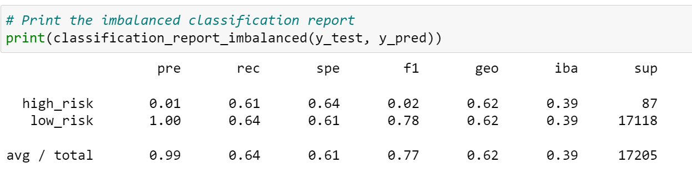
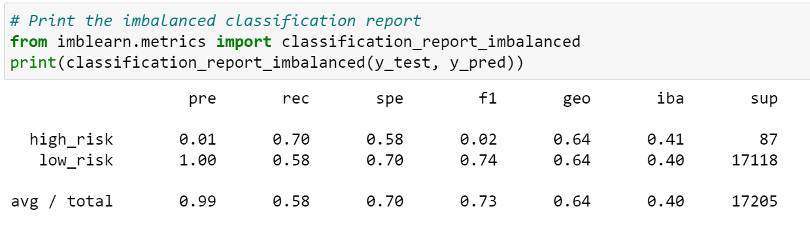
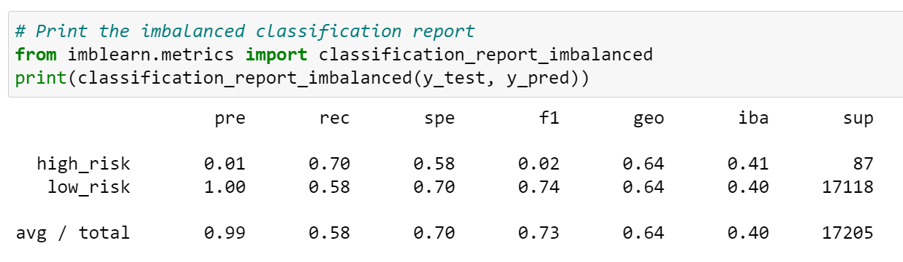
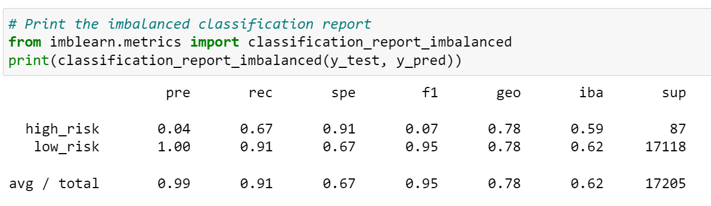
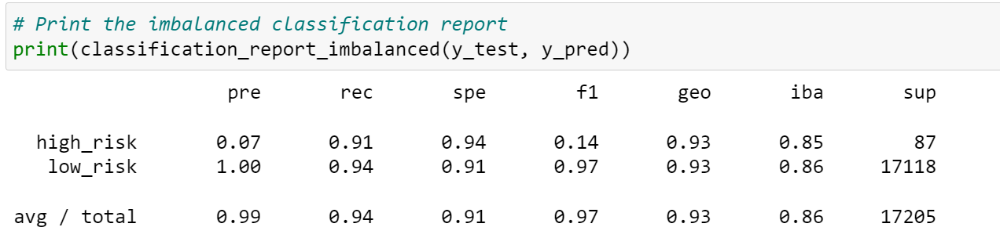

## Credit_Risk_Analysis

### Overview of the loan prediction risk analysis
The purpose of this project is to different techniques to train and evaluate models with unbalanced classes and determine which one is better. We are using the credit card credit dataset from LendingClub, a peer-to-peer lending services company. 
We are oversampling the data using the RandomOverSampler and SMOTE algorithms, and undersampling the data using the ClusterCentroids algorithm. 
We are also using a combinatorial approach of over- and undersampling using the SMOTEENN algorithm. Finally, we will compare two new machine learning models that reduce bias, BalancedRandomForestClassifier and EasyEnsembleClassifier, to predict credit risk. 

## Results
### Naive Random Oversampling

* The balanced accuracy score for Naive Random oversampling was 0.652301872197445. 
* The precision for high_risk was 0.01 and 1.00 for low risk. The average/total was 0.99
* The recall for high_risk was 0.61 and 0.70 for low_risk. The average/total was 0.69
### SMOTE Oversampling

* The balanced accuracy score for Naive Random oversampling was 0.6233557336298552 
* The precision for high_risk was 0.01 and 1.00 for low risk. The average/total was 0.99
* The recall for high_risk was 0.70 and 0.58 for low_risk. The average/total was 0.58
### Undersampling 

* The balanced accuracy score for Naive Random oversampling was 0.6419346846030192 
* The precision for high_risk was 0.01 and 1.00 for low risk. The average/total was 0.99
* The recall for high_risk was 0.61 and 0.64 for low_risk. The average/total was 0.64
### Combination Under-Over Sampling

* The balanced accuracy score for Naive Random oversampling was 0.5103309281216384 
* The precision for high_risk was 0.01 and 1.00 for low risk. The average/total was 0.99
* The recall for high_risk was 0.70 and 0.58 for low_risk. The average/total was 0.58
### Balanced Random Forest Classifier

* The balanced accuracy score for Naive Random oversampling was 0.7877672625306695 
* The precision for high_risk was 0.04 and 1.00 for low risk. The average/total was 0.99
* The recall for high_risk was 0.67 and 0.91 for low_risk. The average/total was 0.91
### Easy Ensemble AdaBoost Classifier

* The balanced accuracy score for Naive Random oversampling was 0.925427358175101
* The precision for high_risk was 0.07 and 1.00 for low risk. The average/total was 0.99
* The recall for high_risk was 0.91 and 0.94 for low_risk. The average/total was 0.94

## Summary
After reviewing all six models, the EasyEnsembleClassifer model yielded the best results. The balanced accuracy score was 0.925  and a 7% precision rate when predicting "High Risk" candidates. The recall or sensitivity rate was also the highest at 94%. 
The second best model was the Balanced Random Forest Classifier with a balanced accuracy score was 0.787 and recall of 0.91

I would recommend the EasyEnsembleClassifer model to predict credit card risk. 
